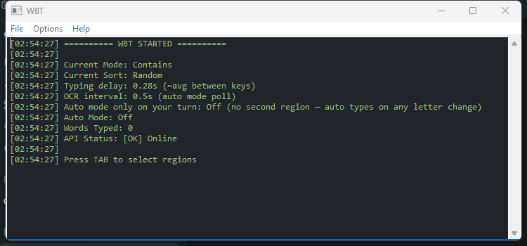

# Word Bomb Tool — Go edition

[](LICENSE)
[](https://go.dev/dl/)
[](#requirements)

A Go port of the Python "Word Bomb Tool". It reads letters from a chosen
screen region with OCR, fetches word suggestions from the
[Datamuse API](https://api.datamuse.com/words), and types a matching word into
the game — with global hotkeys, an auto mode, a system-tray icon, on-screen
region overlays, and a GUI-less CLI.

> ### 🧬 Origin
> This is a faithful, idiomatic **Go** re-implementation of
> **[mPhpMaster/word-bomb-tool](https://github.com/mPhpMaster/word-bomb-tool)**,
> the original Python implementation (Tkinter UI, `pystray` tray icon,
> `keyboard` for hotkeys, `pytesseract` + `mss` for OCR/capture). Config and
> metrics files (`ocr_config.json`, `ocr_metrics.json`, `ocr_helper.log`) are
> written next to the executable and stay format-compatible with the Python
> version, so you can drop this build in beside an existing config. All
> credit for the original concept, design, and implementation goes to that
> project; please go star/support it too.
>
> A later **C#/WPF (.NET 8)** rewrite of the same project also exists at
> [mPhpMaster/word-bomb-tool-cs](https://github.com/mPhpMaster/word-bomb-tool-cs).

> Educational use only. Use responsibly and check the target application's terms
> of service.

## Screenshot



*The main log window on startup — `lxn/walk`'s native Win32 edit control
renders in a single text color (severity is still conveyed by the message
text itself; see [Notes on the port](#notes-on-the-port)).*

## What you get

Two executables:

- **`WordBombGUI.exe`** — the full desktop app (hotkeys, OCR, auto-typing,
  overlays, tray). Windows only. Equivalent to `python main.py`.
- **`WordBombCLI.exe`** — suggestions and definitions only, no GUI or OCR.
  Cross-platform. Equivalent to `python cli.py ...`.

## Requirements

- **To run the GUI:** Windows 10/11 (x64) and
  [Tesseract OCR for Windows](https://github.com/tesseract-ocr/tesseract/releases)
  installed (the app will offer to download and run the installer if it can't
  find `tesseract` on `PATH` or at `C:\Program Files\Tesseract-OCR`).
- **To build:** [Go 1.24+](https://go.dev/dl/). No CGO and no C toolchain are
  required — everything is pure Go using Win32 syscalls.
- **The CLI** needs neither Tesseract nor Windows.

## Build

```bash
git clone https://github.com/mPhpMaster/word-bomb-tool-go.git
cd word-bomb-tool-go
```

Dependencies are vendored, so the project builds offline out of the box:

```powershell
# From the project root, on Windows:
build.bat
```

That produces `dist\WordBombGUI.exe` and `dist\WordBombCLI.exe`.

Or build manually:

```powershell
# GUI (no console window)
go build -mod=vendor -ldflags "-H windowsgui -s -w" -o dist\WordBombGUI.exe .\cmd\wordbombgui
# CLI
go build -mod=vendor -ldflags "-s -w" -o dist\WordBombCLI.exe .\cmd\wordbombcli
```

Cross-compiling the Windows binaries from Linux/macOS works too:

```bash
GOOS=windows GOARCH=amd64 go build -mod=vendor -ldflags "-H windowsgui -s -w" -o dist/WordBombGUI.exe ./cmd/wordbombgui
GOOS=windows GOARCH=amd64 go build -mod=vendor -ldflags "-s -w"             -o dist/WordBombCLI.exe ./cmd/wordbombcli
```

Run the tests (the cross-platform packages — `config`, `datamuse`, `suggest`,
`ocr` preprocessing — are unit-tested):

```bash
go test ./...
```

## Usage

### GUI

Run `WordBombGUI.exe`. Press **Tab** to select the letter region (then, on the
next screen, the "YOUR TURN" box for auto mode — press **Esc** to skip it).
Then press **Shift** to fetch and type a word, or **F1** to toggle auto mode.

Hotkeys (identical to the original):

| Key | Action |
| --- | --- |
| `Shift` | Fetch suggestions and type the next word |
| `Alt+1` | Fetch and show definitions |
| `Tab` | Select regions (letters, then optional YOUR TURN box) |
| `Ctrl+F2` | Clear the turn region |
| `Page Up` | Change search mode |
| `Page Down` | Change sort mode |
| `Delete` | Clear typed history |
| `Ctrl+Z` | Undo last word |
| `Caps Lock` | Toggle the log window + region overlays |
| `F1` | Toggle auto mode |
| `.` | Show the help/hotkeys window |
| `Ctrl+Shift+Q` | Quit (also via the tray icon or File → Exit) |

### CLI

```bash
WordBombCLI.exe suggest LETTERS [--mode MODE] [--sort SORT] [--limit N] [--json] [--pretty-json]
WordBombCLI.exe define WORD [--json] [--pretty-json]
WordBombCLI.exe modes
```

Examples:

```bash
WordBombCLI.exe suggest cat --mode starts-with --sort shortest -n 10
WordBombCLI.exe define puzzle --json
```

Search-mode aliases: `starts-with`, `ends-with`, `contains`, `rhymes`,
`related`. Sort-mode aliases: `shortest`, `longest`, `random`, `frequency`.

## Project layout

```
cmd/
  wordbombcli/     CLI entry point (cli.py)
  wordbombgui/     GUI entry point (main.py) + app.manifest + .syso
internal/
  config/          constants, theme, paths, clamps, modes (config.py)
  datamuse/        Datamuse API client (api_client.py)
  suggest/         sort + next-untyped-word logic (suggestion_manager.py)
  logging/         rotating file log + colored in-memory queue (logging_utils.py)
  state/           thread-safe state + config/metrics persistence (state.py)
  ocr/             screen capture + preprocessing + Tesseract (ocr_processor.py)
  input/           low-level keyboard hook + SendInput typing (keyboard lib)
  ui/              walk windows, overlays, region selector, dialogs, tray
  app/             orchestration wiring it all together (main.py)
```

The core packages (`config`, `datamuse`, `suggest`, `logging`, `state`, and the
`ocr` image preprocessing) are cross-platform and unit-tested; run
`go test ./...`. The `input`, `ui` and `app` packages are Windows-only.

## Notes on the port

The behaviour mirrors the Python app; a few implementation details differ where
Go's ecosystem suggested a cleaner approach:

- **OCR** shells out to the `tesseract` executable (`tesseract stdin stdout …`)
  instead of binding `libtesseract`, so no CGO or C toolchain is needed.
- **Global hotkeys** use a Win32 low-level keyboard hook
  (`SetWindowsHookEx(WH_KEYBOARD_LL)`), the same mechanism the Python `keyboard`
  library uses. Keys are observed, not swallowed, so normal typing still works.
- **Typing** uses `SendInput` with Unicode key events and the same human-like
  timing/jitter as the original.
- **Region overlays** are frameless, click-through, color-keyed windows that draw
  only a colored border (fully transparent interior), so the overlay never tints
  the captured OCR area.
- **The log view** uses a single text color rather than per-line coloring
  (a plain Win32 edit control can't color individual lines); severity is still
  visible via the message text. Everything is written to `ocr_helper.log`.
- `go vet` reports two "possible misuse of unsafe.Pointer" notes in
  `internal/input/hook_windows.go`. These are the standard, correct
  `uintptr`→struct-pointer conversions inside the Win32 hook callback (the OS
  keeps the struct alive for the duration of the call) and are an expected
  false positive at the syscall boundary.

## Contributing

Contributions are welcome — see [CONTRIBUTING.md](CONTRIBUTING.md).

## License

MIT — see [LICENSE](LICENSE). This is a derivative Go port of the original
MIT-licensed Word Bomb Tool.

## Credits

- **[mPhpMaster/word-bomb-tool](https://github.com/mPhpMaster/word-bomb-tool)** —
  the original Python implementation this project is a port of.
- **[lxn/walk](https://github.com/lxn/walk)** — the Win32 GUI toolkit used for
  the desktop app.
- **[Datamuse API](https://www.datamuse.com/api/)** — word suggestions and
  definitions.
- **[Tesseract OCR](https://github.com/tesseract-ocr/tesseract)** — text
  recognition.
