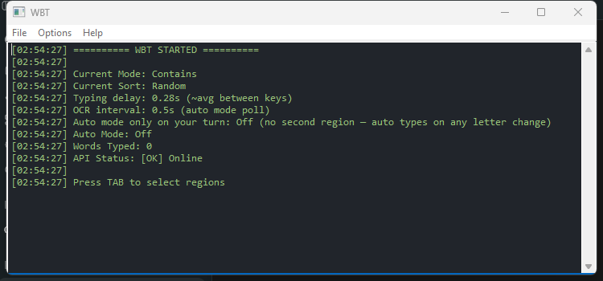

# Word Bomb Tool — Go edition

[](LICENSE)
[](https://go.dev/dl/)
[](#requirements)

A Go port of the Python "Word Bomb Tool". It reads the prompt letters from a
chosen screen region with the OCR engine built into Windows, finds matching
words in built-in English and Arabic word lists (or the
[Datamuse API](https://api.datamuse.com/words) for rhymes and related words),
and types a matching word into the game — in about 0.2s, with global hotkeys,
an auto mode, a system-tray icon, on-screen region overlays, and a GUI-less
CLI.

> ### 🧬 Origin
> This is a faithful, idiomatic **Go** re-implementation of
> **[mPhpMaster/word-bomb-tool](https://github.com/mPhpMaster/word-bomb-tool)**,
> the original Python implementation (Tkinter UI, `pystray` tray icon,
> `keyboard` for hotkeys, `pytesseract` + `mss` for OCR/capture). Config and
> metrics files (`ocr_config.json`, `ocr_metrics.json`, `ocr_helper.log`) are
> written next to the executable and stay format-compatible with the Python
> version, so you can drop this build in beside an existing config. All
> credit for the original concept, design, and implementation goes to that
> project; please go star/support it too.
>
> A later **C#/WPF (.NET 8)** rewrite of the same project also exists at
> [mPhpMaster/word-bomb-tool-cs](https://github.com/mPhpMaster/word-bomb-tool-cs).

> Educational use only. Use responsibly and check the target application's terms
> of service.

## Screenshot



*The main log window on startup — `lxn/walk`'s native Win32 edit control
renders in a single text color (severity is still conveyed by the message
text itself; see [Notes on the port](#notes-on-the-port)).*

## What you get

Two executables:

- **`WordBombGUI.exe`** — the full desktop app (hotkeys, OCR, auto-typing,
  overlays, tray). Windows only. Equivalent to `python main.py`.
- **`WordBombCLI.exe`** — suggestions and definitions only, no GUI or OCR.
  Cross-platform. Equivalent to `python cli.py ...`.

### How a prompt is answered

1. **Reading the letters.** The region is captured, binarized and cleaned up
   (region frames, small counters such as "1K" and background specks are
   dropped), then read in-process by **Windows OCR** (`Windows.Media.Ocr`) in
   about 10-20ms. Short prompts such as `AB` or `TR` are placed after a known
   word and repeated three times, and the majority reading wins. Prompts are
   read as **English or Arabic**: the Arabic reading is used when all three
   copies agree on it and the English engine doesn't read the same letters on
   all three copies.
2. **Finding words.** Starts With / Ends With / Contains are answered offline
   from the ENABLE word list (~173k English words, shortest first) or a
   frequency-ordered Arabic list (~354k words, most common first). A capital I
   misread as l is corrected when the swap matches ten times as many words.
   Rhymes and Related Words use Datamuse (English only; Arabic prompts fall back
   to Contains). Readings that no word contains are treated as misreads and
   nothing is typed.
3. **Typing.** Fast typing (the default) types with a 12ms gap between keys as
   Unicode key events, so Arabic needs no Arabic keyboard layout. Before Enter
   the letters are read again; the word is only erased if three reads in a row
   show other letters (the shaking bomb makes single reads flicker). Options >
   Fast typing (on/off) switches back to human-like timing (saved as
   `fast_typing` in `ocr_config.json`).

## Requirements

- **To run the GUI:** Windows 10 version 2004 or later, or Windows 11 (x64),
  with an OCR language installed (English Windows has one; add Arabic under
  Settings > Time & language > Language & region to read Arabic prompts). Only
  when Windows has no OCR language at all does the app fall back to
  [Tesseract OCR](https://github.com/tesseract-ocr/tesseract/releases) and offer
  to install it.
- **To build:** [Go 1.24+](https://go.dev/dl/). No CGO and no C toolchain are
  required — everything is pure Go using Win32 syscalls.
- **The CLI** needs neither OCR nor Windows.

## Installation

**Easiest:** grab `WordBombTool-Setup.exe` from the
[Releases](../../releases) page and run it. It installs both executables,
adds Start Menu / optional desktop shortcuts, an optional "add CLI to PATH"
task, and a clean uninstaller — no admin rights required, and no separate
runtime to install (the Go binaries are statically linked).

**From source:** see [Build](#build) below.

## Build

```bash
git clone https://github.com/mPhpMaster/word-bomb-tool-go.git
cd word-bomb-tool-go
```

Dependencies are vendored, so the project builds offline out of the box:

```powershell
# From the project root, on Windows:
build.bat
```

That produces `dist\WordBombGUI.exe` and `dist\WordBombCLI.exe`.

Or build manually:

```powershell
# GUI (no console window)
go build -mod=vendor -ldflags "-H windowsgui -s -w" -o dist\WordBombGUI.exe .\cmd\wordbombgui
# CLI
go build -mod=vendor -ldflags "-s -w" -o dist\WordBombCLI.exe .\cmd\wordbombcli
```

Cross-compiling the Windows binaries from Linux/macOS works too:

```bash
GOOS=windows GOARCH=amd64 go build -mod=vendor -ldflags "-H windowsgui -s -w" -o dist/WordBombGUI.exe ./cmd/wordbombgui
GOOS=windows GOARCH=amd64 go build -mod=vendor -ldflags "-s -w"             -o dist/WordBombCLI.exe ./cmd/wordbombcli
```

Run the tests (word lists, OCR preprocessing and prompt reading, the WinRT OCR
client, state, Datamuse, suggestions). The OCR tests draw prompts in the
Windows fonts and read real game captures from `internal/ocr/testdata`; they
skip when no Windows OCR language is installed:

```bash
go test ./...
```

### Building the installer

Requires [Inno Setup 6](https://jrsoftware.org/isinfo.php)
(`winget install JRSoftware.InnoSetup`):

```powershell
build.bat
& "C:\Program Files (x86)\Inno Setup 6\ISCC.exe" installer\WordBombTool.iss
```

Output: `dist\installer\WordBombTool-Setup.exe`.

## Usage

### GUI

Run `WordBombGUI.exe`. Press **Tab** to select the letter region (then, on the
next screen, the "YOUR TURN" box for auto mode — press **Esc** to skip it).
Then press **Shift** to fetch and type a word, or **F1** to toggle auto mode.

Hotkeys (identical to the original):

| Key | Action |
| --- | --- |
| `Shift` | Fetch suggestions and type the next word |
| `Alt+1` | Fetch and show definitions |
| `Tab` | Select regions (letters, then optional YOUR TURN box) |
| `Ctrl+F2` | Clear the turn region |
| `Page Up` | Change search mode |
| `Page Down` | Change sort mode |
| `Delete` | Clear typed history |
| `Ctrl+Z` | Undo last word |
| `Caps Lock` | Toggle the log window + region overlays |
| `F1` | Toggle auto mode |
| `.` | Show the help/hotkeys window |
| `Ctrl+Shift+Q` | Quit (also via the tray icon or File → Exit) |

### CLI

```bash
WordBombCLI.exe suggest LETTERS [--mode MODE] [--sort SORT] [--limit N] [--json] [--pretty-json]
WordBombCLI.exe define WORD [--json] [--pretty-json]
WordBombCLI.exe modes
```

Examples:

```bash
WordBombCLI.exe suggest --mode starts-with --sort shortest -n 10 cat
WordBombCLI.exe suggest --mode contains يز
WordBombCLI.exe define --json puzzle
```

Search-mode aliases: `starts-with`, `ends-with`, `contains`, `rhymes`,
`related`. Sort-mode aliases: `shortest`, `longest`, `random`, `frequency`.
Flags go before the letters. Starts With / Ends With / Contains are answered
from the built-in word lists (no network); Rhymes, Related Words and
definitions use Datamuse.

## Project layout

```
cmd/
  wordbombcli/     CLI entry point (cli.py)
  wordbombgui/     GUI entry point (main.py) + app.manifest + .syso
internal/
  config/          constants, theme, paths, clamps, modes (config.py)
  datamuse/        Datamuse API client (api_client.py)
  suggest/         sort + next-untyped-word logic (suggestion_manager.py)
  logging/         rotating file log + colored in-memory queue (logging_utils.py)
  state/           thread-safe state + config/metrics persistence (state.py)
  ocr/             screen capture, preprocessing, prompt reading (ocr_processor.py)
  winocr/          minimal WinRT client for Windows.Media.Ocr
  wordlist/        embedded English (ENABLE) and Arabic word lists
  input/           low-level keyboard hook + SendInput typing (keyboard lib)
  ui/              walk windows, overlays, region selector, dialogs, tray
  app/             orchestration wiring it all together (main.py)
```

The core packages (`config`, `datamuse`, `suggest`, `logging`, `state`,
`wordlist`, and the `ocr` image preprocessing) are cross-platform; `winocr`,
`input`, `ui` and `app` are Windows-only. Run `go test ./...`.

## Notes on the port

The behaviour mirrors the Python app; a few implementation details differ where
Go's ecosystem suggested a cleaner approach:

- **OCR** uses the Windows OCR engine through a small hand-written WinRT client
  (`internal/winocr`: activation factories from `combase.dll` and vtable calls,
  all on one OS thread), so no CGO or C toolchain is needed. The fallback for
  systems without an OCR language shells out to the `tesseract` executable.
- **Global hotkeys** use a Win32 low-level keyboard hook
  (`SetWindowsHookEx(WH_KEYBOARD_LL)`), the same mechanism the Python `keyboard`
  library uses. Keys are observed, not swallowed, so normal typing still works.
- **Typing** uses `SendInput` with Unicode key events: fast by default, or the
  original's human-like timing/jitter.
- **Region overlays** are frameless, click-through, color-keyed windows that draw
  only a colored border, 3px outside the region, and are excluded from screen
  capture (`WDA_EXCLUDEFROMCAPTURE`), so the OCR never sees them.
- **The log view** uses a single text color rather than per-line coloring
  (a plain Win32 edit control can't color individual lines); severity is still
  visible via the message text. Everything is written to `ocr_helper.log`.

## Contributing

Contributions are welcome — see [CONTRIBUTING.md](CONTRIBUTING.md).

## License

MIT — see [LICENSE](LICENSE). This is a derivative Go port of the original
MIT-licensed Word Bomb Tool. Bundled data and libraries keep their own
licences (the Arabic word list is CC BY-SA 4.0); see
[THIRD_PARTY_NOTICES.md](THIRD_PARTY_NOTICES.md).

## Credits

- **[mPhpMaster/word-bomb-tool](https://github.com/mPhpMaster/word-bomb-tool)** —
  the original Python implementation this project is a port of.
- **[lxn/walk](https://github.com/lxn/walk)** — the Win32 GUI toolkit used for
  the desktop app.
- **ENABLE word list** (public domain) — English words.
- **[FrequencyWords](https://github.com/hermitdave/FrequencyWords)** by Hermit
  Dave (CC BY-SA 4.0), filtered with the
  [Ayaspell](http://ayaspell.sourceforge.net/) dictionary — Arabic words.
- **[Datamuse API](https://www.datamuse.com/api/)** — rhymes, related words and
  definitions.
- **Windows OCR** (`Windows.Media.Ocr`) — text recognition, with
  **[Tesseract OCR](https://github.com/tesseract-ocr/tesseract)** as a fallback.
